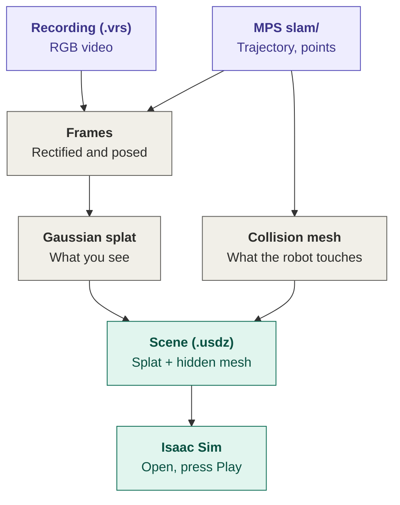

# ContactSplat
Walk through a place once with Aria Gen 2 glasses, then drive a robot through it in Isaac Sim

<div align="center">
  
</div>

ContactSplat turns one Project Aria Gen 2 recording into a simulation scene for NVIDIA Isaac Sim. It trains a 3D Gaussian splat on the RGB video for <u>appearance</u>, builds a triangle mesh from the MPS SLAM point cloud for <u>collisions</u>, and packs both into <u>one .usdz file</u>. Both come out in the MPS world frame (metres, Z up), so they line up with no alignment step. The preprocessing and splat training are from Meta's [egocentric_splats](https://github.com/facebookresearch/egocentric_splats).



## User Guide

You need **Linux with an NVIDIA GPU** (16 GB or more), a **Python 3.10** environment with CUDA PyTorch, and [COLMAP](https://colmap.github.io/install.html) built with CUDA on your `PATH`. The result opens in **Isaac Sim 5.1**.

**1. Install.**

```bash
git clone --branch mps-mesh https://github.com/Aidan-Gildea/ContactSplat.git
cd ContactSplat
pip install -r requirements.txt
```

**2. Get MPS SLAM output** for your recording. The pipeline expects it in the same folder as the `.vrs`, named `mps_<recording>_vrs/`. `aria_mps` puts it there by default. Record with Aria profile `profile10` (RGB 2016×1512 at 30 Hz), which the defaults assume. Sample recordings with their MPS output are in the [ContactSplat Sample Trajectories](https://drive.google.com/drive/folders/1INGZFiCD6qYtHSzbXo4Qegmj-flwikv0) folder.

```text
recordings/
├── Outside_20260812_141244.vrs
└── mps_Outside_20260812_141244_vrs/
    └── slam/
```

```bash
aria_mps single -i recordings/Outside_20260812_141244.vrs --features SLAM
```

**3. Run the pipeline.** Pass the `.vrs`. It runs four stages and skips any that already finished, so you can stop it and run it again. Training the splat is the slow part (about 2 hours). The mesh takes about a minute.

```bash
bash run_contactsplat.sh recordings/Outside_20260812_141244.vrs
```

| Stage | Script | What it makes |
| --- | --- | --- |
| 1. Frames | `scripts/bash_local/run_gen2_outside.sh` | Undistorted RGB frames, each with its camera pose from MPS |
| 2. Splat | `scripts/bash_local/train_gen2_outside.sh` | The Gaussian splat, trained for 30k steps |
| 3. Mesh | `mps-mesh/run_mps_mesh.sh` | A mesh from the MPS points, plus a simplified copy used as the collider |
| 4. Scene | `isaacsim/splat_and_mesh_to_usdz.py` | One `.usdz` with the splat (visible) and the mesh (invisible collider) |

This is where everything is written:

```text
recordings/
└── processed/Outside_20260812_141244/camera-rgb-rectified-1008-h1512/        1. frames
ContactSplat/output/
├── Outside_20260812_141244/camera-rgb-rectified-1008-h1512/
│   ├── point_cloud/iteration_30000/point_cloud.ply                           2. splat
│   └── isaacsim/Outside_20260812_141244_with_collider.usdz                   4. scene
└── mps-mesh/Outside_20260812_141244/camera-rgb-rectified-1008-h1512/
    ├── mesh_delaunay_decimated.ply                                            3. collider
    └── report_decimated.md                                                    mesh score
```

`report_decimated.md` scores the collider: how much of the walked floor it covers, its largest hole, and its floor height error.

**4. Open it in Isaac Sim.** Use File > Open on the `.usdz` and press Play to turn on collisions. The splat is what you see. The mesh is invisible and only collides.

<div align="center">
  
  <p><i>Left: the splat you see. Right: the hidden collision mesh the robot drives on.</i></p>
</div>

**5. Tune (optional).** Set these before the command, for example `EYE_HEIGHT=1.70 bash run_contactsplat.sh ...`.

| Variable | Default | Effect |
| --- | --- | --- |
| `EYE_HEIGHT` | `1.6683` | Height of the glasses above the floor in metres. Only used to score the mesh |
| `CAP_MAX` | `1500000` | Most Gaussians the splat can grow to. Lower it if training runs out of GPU memory |
| `DECIMATE` | `1` | `0` uses the full mesh as the collider instead of the simplified copy |
| `MESH_SOURCE` | `mps` | `mvs` builds the collider with COLMAP multi-view stereo instead (`photogrammetry/`). It takes hours instead of a minute, and outdoors it covers the floor only slightly better. Known bug: if the frame timestamps change length partway through a recording, frames get the wrong poses and the mesh is wrong |
| `MPS_FOLDER` | `recordings/mps_<recording>_vrs/slam` | Where the MPS SLAM output is |
| `OUT_ROOT` | `recordings/processed` | Where the frames go |
| `OUTPUT_ROOT` | `ContactSplat/output` | Where the splat, mesh and scene go |

To look at the splat on its own in a browser (port 8080):

```bash
python launch_viewer.py model_root=output/Outside_20260812_141244
```

## Recording tips

- Walk through the scene. Turning in place gives no depth.
- Record for 2 to 5 minutes, and pass earlier spots again so MPS can close loops.
- Turn your head slowly and avoid dim places. Indoors the camera exposure is long, so fast motion blurs the frames.

## Repository layout

| Path | What it does |
| --- | --- |
| `run_contactsplat.sh` | Runs the whole pipeline |
| `scripts/extract_aria_vrs.py` | Stage 1: reads the `.vrs` and the MPS output, writes rectified, posed frames |
| `train_lightning.py`, `model/`, `scene/`, `conf/` | Stage 2: splat training (from egocentric_splats) |
| `mps-mesh/` | Stage 3: collision mesh from the MPS points |
| `photogrammetry/` | Mesh scoring and simplification used by stage 3, and the optional multi-view stereo mesh |
| `isaacsim/splat_and_mesh_to_usdz.py` | Stage 4: the Isaac Sim scene |
| `debug_scripts/`, `docs/` | Checks, and notes on Aria Gen 2 and rectification |

## Citation

This work builds on egocentric_splats:

```
@inproceedings{lv2025egosplats,
    title={Photoreal Scene Reconstruction from an Egocentric Device},
    author={Lv, Zhaoyang and Monge, Maurizio and Chen, Ka and Zhu, Yufeng and Goesele, Michael and Engel, Jakob and Dong, Zhao and Newcombe, Richard},
    booktitle={ACM SIGGRAPH},
    year={2025}
}
```

## License

[CC BY-NC 4.0](LICENSE), inherited from [egocentric_splats](https://github.com/facebookresearch/egocentric_splats). Meshing uses [COLMAP](https://colmap.github.io/), splat training uses [gsplat](https://github.com/nerfstudio-project/gsplat), and the USDZ writer adapts code from [3dgrut](https://github.com/nv-tlabs/3dgrut) (Apache 2.0).
