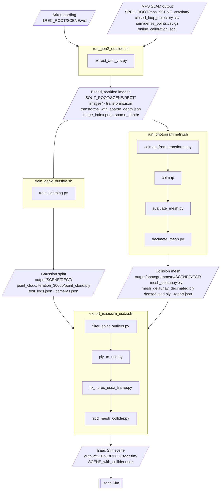

# ContactSplat

<p align="center">
  
</p>

This repository provides a pipeline that generates contact-rich, photorealistic simulation
environments for NVIDIA Isaac Sim from a single trajectory recorded with Project Aria Gen 2
glasses. Each environment is a single USDZ file containing two co-registered assets: a 3D
Gaussian splat that provides the visual appearance, and a multi-view stereo mesh that is
invisible to the renderer and acts as a static collider for physics. Both assets are
reconstructed in the metric, gravity-aligned world frame produced by Aria Machine
Perception Services (MPS), so they are aligned by construction and no registration step is
required.

This repository is a fork of Meta's
[egocentric_splats](https://github.com/facebookresearch/egocentric_splats). The
preprocessing, training, rendering and viewer code are inherited from that project and
extended to support Aria Gen 2 recordings. The mesh reconstruction and Isaac Sim export
stages are new.

## Contents

- [Contents](#contents)
- [1. Pipeline Overview](#1-pipeline-overview)
- [2. Dependencies and Installation](#2-dependencies-and-installation)
- [3. Sample Recordings](#3-sample-recordings)
- [4. Running the Pipeline](#4-running-the-pipeline)
  - [4.1 Preprocessing](#41-preprocessing)
  - [4.2 Training the Gaussian splat](#42-training-the-gaussian-splat)
  - [4.3 Reconstructing the collision mesh](#43-reconstructing-the-collision-mesh)
  - [4.4 Exporting to Isaac Sim](#44-exporting-to-isaac-sim)
  - [4.5 Visualization](#45-visualization)
- [5. Recording New Scenes](#5-recording-new-scenes)
- [6. Repository Structure](#6-repository-structure)
- [7. Citations](#7-citations)
- [8. License and Acknowledgements](#8-license-and-acknowledgements)

## 1. Pipeline Overview

The pipeline consists of four shell scripts. Each script reads the output of the previous
stage, and stages 4.2 and 4.3 are independent of each other. Rounded nodes are environment
variables set with `export`.



`SCENE` is the recording name, and `RECT` is the rectified camera folder, `camera-rgb-rectified-1008-h1512`.
`REC_ROOT` and `OUT_ROOT` are set with `export`; `OUT_ROOT` defaults to `$REC_ROOT/processed`.

| Stage | Script | Input | Output |
|---|---|---|---|
| Preprocessing | `scripts/bash_local/run_gen2_outside.sh` | VRS recording, MPS SLAM output | rectified images, `transforms.json`, sparse depth |
| Splat training | `scripts/bash_local/train_gen2_outside.sh` | preprocessed dataset | `point_cloud.ply` |
| Mesh reconstruction | `photogrammetry/run_photogrammetry.sh` | preprocessed dataset | `mesh_delaunay.ply`, `mesh_delaunay_decimated.ply` |
| Isaac Sim export | `isaacsim/export_isaacsim_usdz.sh` | splat PLY, mesh PLY | `<SCENE>_with_collider.usdz` |

## 2. Dependencies and Installation

- Linux with an NVIDIA GPU and CUDA. Splat training (gsplat) and dense stereo (COLMAP)
  have no CPU backend.
- The default training configuration fits in 16 GB of GPU memory.
- Isaac Sim 5.1 to load the exported scene.

The pipeline uses two conda environments: `ego_splats` for stages 4.1 through 4.3 and for
the first step of 4.4, and `3dgrut` for the remaining steps of 4.4.

```bash
git clone --branch pipeline https://github.com/Aidan-Gildea/ContactSplat.git
cd ContactSplat

conda create -n ego_splats python=3.10 -y
conda activate ego_splats

# Install torch first, from the CUDA index that matches your driver (see nvidia-smi)
pip install torch torchvision torchaudio --index-url https://download.pytorch.org/whl/cu128
pip install -r requirements.txt
pip install projectaria-mps open3d

# Should print the torch version and True
python -c "import torch; print(torch.__version__, torch.cuda.is_available())"
```

> [!NOTE]
> If the check prints `False`, the installed torch build does not match the system CUDA
> version. Reinstall torch from the matching index.

Stage 4.3 requires a CUDA-enabled build of [COLMAP](https://colmap.github.io/install.html)
on `PATH`.

Stage 4.4 requires a checkout of [3dgrut](https://github.com/nv-tlabs/3dgrut) at `~/3dgrut`
with its conda environment named `3dgrut`, installed following the 3dgrut README. A
different checkout location can be set with `export GRUT_REPO=/path/to/3dgrut`.

## 3. Sample Recordings

The recordings used in this project are available in the
[ContactSplat Sample Trajectories](https://drive.google.com/drive/folders/1INGZFiCD6qYtHSzbXo4Qegmj-flwikv0)
Google Drive folder. Each sample (Room, Outside, Hall) contains the Aria Gen 2 VRS file
and its MPS SLAM output.

The scripts expect the following layout, where the directory is `REC_ROOT` and the VRS
filename without its extension is `SCENE`:

```
<REC_ROOT>/
├── <SCENE>.vrs
└── mps_<SCENE>_vrs/
    └── slam/
        ├── closed_loop_trajectory.csv
        ├── online_calibration.jsonl
        ├── semidense_points.csv.gz
        └── semidense_observations.csv.gz
```

If the MPS output is stored elsewhere, set `MPS_FOLDER` to the `slam` directory.

## 4. Running the Pipeline

All commands are run from the repository root. Set the following variables once per shell:

```bash
conda activate ego_splats
export REC_ROOT=/path/to/recordings
export SCENE=Outside_20260812_141244
```

The default rectification parameters (focal length 1008 px, height 1512 px) assume a
recording made with Aria recording profile `profile10`. For other profiles, see
[docs/rectification.md](docs/rectification.md).

### 4.1 Preprocessing

```bash
bash scripts/bash_local/run_gen2_outside.sh
```

Reads the VRS file together with the MPS closed-loop trajectory, online calibration and
semi-dense point cloud. The RGB stream is rectified from the Aria fisheye model to a
pinhole camera with a 90 degree horizontal field of view, and a pose is assigned to each
frame from the MPS trajectory at the frame's exposure timestamp. Output is written to
`$REC_ROOT/processed/$SCENE/camera-rgb-rectified-1008-h1512/`.

The output can be checked before training with:

```bash
python debug_scripts/verify_preprocessing.py "$REC_ROOT/processed/$SCENE/camera-rgb-rectified-1008-h1512"
```

### 4.2 Training the Gaussian splat

```bash
bash scripts/bash_local/train_gen2_outside.sh
```

Trains a 3DGS model with gsplat for 30k iterations. Camera poses are taken from MPS and
are not optimized, the MPS semi-dense points initialize the Gaussians, and rolling shutter
is modelled during rendering. Densification uses the MCMC strategy with a capped Gaussian
count. The trained model is written to
`output/$SCENE/camera-rgb-rectified-1008-h1512/point_cloud/iteration_30000/point_cloud.ply`.

> [!NOTE]
> The defaults train at half resolution with a cap of 1.5M Gaussians to fit in 16 GB of
> GPU memory. On GPUs with 24 GB or more, see the comments in the script for higher
> quality settings.

### 4.3 Reconstructing the collision mesh

```bash
DECIMATE=1 bash photogrammetry/run_photogrammetry.sh \
    "$REC_ROOT/processed/$SCENE/camera-rgb-rectified-1008-h1512"
```

Reconstructs a mesh with COLMAP multi-view stereo while holding the MPS camera poses and
intrinsics fixed. COLMAP's `mapper` is never run: keyframes are selected from the
trajectory, SIFT features are matched sequentially, and points are triangulated against
the fixed poses before patch-match stereo, fusion and Delaunay meshing. The mesh is
therefore in the same frame and scale as the splat. Each mesh is scored against the MPS
geometry in `report.md`.

With `DECIMATE=1`, the script also writes `mesh_delaunay_decimated.ply`, a simplified
copy with long spurious edges removed and the triangle count reduced, which is better
suited for collision checking. Output is written to
`output/photogrammetry/$SCENE/camera-rgb-rectified-1008-h1512/`.

Completed stages are skipped on re-run. `FORCE=1` reruns every stage, and
`STOP_AFTER=triangulate` stops after the sparse model so the alignment can be inspected
before dense stereo. See [photogrammetry/README.md](photogrammetry/README.md) for the full
list of options.

### 4.4 Exporting to Isaac Sim

```bash
bash isaacsim/export_isaacsim_usdz.sh
```

Packages the splat and the mesh into one USDZ file in four steps:

1. `scripts/filter_splat_outliers.py` removes Gaussians more than 50 m from the median
   Gaussian position, which would otherwise inflate the scene's bounding box.
2. 3dgrut's `ply_to_usd.py` converts the splat PLY to the NuRec USDZ format rendered by
   Isaac Sim.
3. `scripts/fix_nurec_usdz_frame.py` removes the rotation that the 3dgrut exporter applies,
   restoring the MPS Z-up frame.
4. `isaacsim/add_mesh_collider.py` adds the mesh as an invisible static collider.

The decimated mesh is used if it exists, otherwise the full mesh. Output is written to
`output/$SCENE/camera-rgb-rectified-1008-h1512/isaacsim/${SCENE}_with_collider.usdz`.
Open the file in Isaac Sim with File > Open and press Play to enable collisions.

<!-- media: opening the USDZ in Isaac Sim and pressing Play

-->

### 4.5 Visualization

To view trained splats in the web viewer (port 8080):

```bash
python launch_viewer.py model_root="output/$SCENE"
```

To render a video along the recorded trajectory:

```bash
RECT=camera-rgb-rectified-1008-h1512 bash scripts/bash_local/run_aria_render.sh
```

<!-- media: side-by-side of the splat and the collision mesh

-->

## 5. Recording New Scenes

Record with Aria Gen 2 recording profile `profile10` (RGB 2016x1512 at 30 Hz). All defaults
in this repository assume this profile. A higher frame rate provides more viewpoints, which
matters more for reconstruction quality than per-frame resolution.

Reconstruction quality depends mostly on the capture:

- Translate through the scene. Rotating in place provides no baseline for depth.
- Record for 2 to 5 minutes and cover the scene from several heights and viewing angles.
- Revisit earlier viewpoints so that MPS can close loops.
- Avoid fast motion and low light, which cause motion blur.

Then run MPS SLAM on the recording, either in Aria Studio or from the command line:

```bash
aria_mps single -i "$REC_ROOT/$SCENE.vrs" --features SLAM
```

See [docs/gen2.md](docs/gen2.md) for further notes on Aria Gen 2.

## 6. Repository Structure

| Path | Contents |
|---|---|
| `scripts/extract_aria_vrs.py`, `scripts/aria_utils.py` | VRS and MPS preprocessing |
| `scripts/bash_local/` | preprocessing, training and rendering scripts |
| `train_lightning.py`, `render_lightning.py`, `launch_viewer.py` | training, rendering and viewer entry points |
| `model/` | 3DGS and 2DGS models and losses |
| `scene/` | dataset loading and Aria camera models |
| `utils/`, `viewer/`, `conf/` | utilities, web viewer and training configurations |
| `photogrammetry/` | fixed-pose COLMAP mesh reconstruction |
| `isaacsim/` | Isaac Sim export |
| `debug_scripts/` | environment, recording and dataset checks |
| `docs/` | notes on Aria Gen 2 support and rectification |

Aria Gen 1 recordings are also supported. The full pipeline has been tested on Gen 2. Gen 1
has been tested through preprocessing.

## 7. Citations

<!-- TODO: add the ContactSplat BibTeX here once the preprint has an arXiv ID -->

This work builds on egocentric_splats:

```
@inproceedings{lv2025egosplats,
    title={Photoreal Scene Reconstruction from an Egocentric Device},
    author={Lv, Zhaoyang and Monge, Maurizio and Chen, Ka and Zhu, Yufeng and Goesele, Michael and Engel, Jakob and Dong, Zhao and Newcombe, Richard},
    booktitle={ACM SIGGRAPH},
    year={2025}
}
```

## 8. License and Acknowledgements

This repository is released under the [CC BY-NC 4.0](LICENSE) license, inherited from
egocentric_splats.

We thank the authors of [egocentric_splats](https://github.com/facebookresearch/egocentric_splats),
on which this repository is based. Mesh reconstruction uses
[COLMAP](https://colmap.github.io/), splat training uses
[gsplat](https://github.com/nerfstudio-project/gsplat), and the Isaac Sim export uses the
USDZ exporter from [3dgrut](https://github.com/nv-tlabs/3dgrut).
