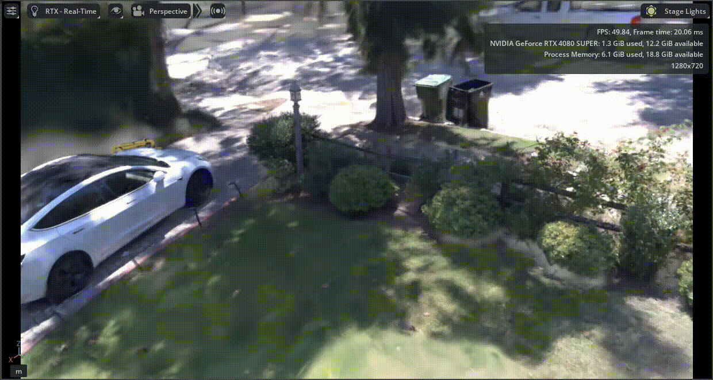
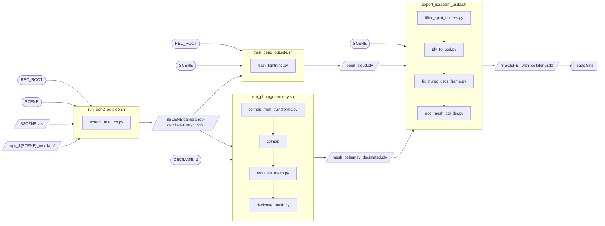

# ContactSplat

**Walk around a place once wearing Project Aria Gen 2 glasses, and get back a
photorealistic simulation environment that robots can actually touch.**

This repo turns a single Aria Gen 2 recording into one `.usdz` file for NVIDIA Isaac Sim
that contains two things stacked exactly on top of each other:

- a **Gaussian splat** you *see*: photoreal, rendered by Isaac Sim's RTX renderer
- a **photogrammetry mesh** you *hit*: invisible, but it's the collider, so robots can
  drive on the floor and bump into walls

They line up with no manual alignment. Both are built in the same metric, gravity-aligned
coordinate frame from Aria's Machine Perception Services (MPS), so you can drop the
file into a stage and press Play.

<!-- media: hero GIF, e.g. a robot driving through the Outside scene in Isaac Sim

-->

It's built on top of Meta's
[egocentric_splats](https://github.com/facebookresearch/egocentric_splats) (see
[Credits](#credits)), with Aria Gen 2 support added and a mesh + Isaac Sim stage bolted
on the end.

---

## The pipeline at a glance

Four shell scripts, run in order. Each one takes the previous one's output. The rounded
boxes are the variables you `export` in your terminal.



### What each step actually does

**1. Preprocess:** [`scripts/bash_local/run_gen2_outside.sh`](scripts/bash_local/run_gen2_outside.sh)
Takes the raw recording (`.vrs`) plus the MPS output (camera trajectory, calibration,
and a sparse 3D point cloud) and turns it into a plain, easy-to-use dataset: undistorted
pinhole images, a camera pose for every frame (`transforms.json`), and sparse depth. The
Aria fisheye gets "rectified" to a normal 90° pinhole camera here, which is what the rest
of the pipeline expects.
→ `$REC_ROOT/processed/$SCENE/camera-rgb-rectified-1008-h1512/`

**2. Train the splat:** [`scripts/bash_local/train_gen2_outside.sh`](scripts/bash_local/train_gen2_outside.sh)
Fits a 3D Gaussian splat to those images, using the MPS poses as-is (no COLMAP-style
pose estimation) and the MPS points as the starting point cloud. It also models the RGB
camera's rolling shutter, which matters because you're walking while recording. The
defaults fit on a 16 GB GPU. On a 24 GB+ card you can go sharper (see the comments in
the script).
→ `output/$SCENE/camera-rgb-rectified-1008-h1512/point_cloud/iteration_30000/point_cloud.ply`

**3. Build the collision mesh:** [`photogrammetry/run_photogrammetry.sh`](photogrammetry/run_photogrammetry.sh)
Runs COLMAP multi-view stereo on the same images, but **keeps the MPS poses fixed**
instead of letting COLMAP solve its own. That's the trick that puts the mesh in the same
frame and scale as the splat. It picks keyframes, triangulates, runs dense stereo, fuses,
meshes, and then scores the mesh against the MPS geometry (`report.md`). With
`DECIMATE=1` it also writes a lighter copy of the mesh, which is what you want for physics.
Steps 2 and 3 don't depend on each other, so run them in either order.
→ `output/photogrammetry/$SCENE/camera-rgb-rectified-1008-h1512/mesh_delaunay_decimated.ply`
(or `mesh_delaunay.ply` without `DECIMATE=1`)

**4. Package for Isaac Sim:** [`isaacsim/export_isaacsim_usdz.sh`](isaacsim/export_isaacsim_usdz.sh)
Cleans up stray far-away Gaussians, converts the splat to NVIDIA's NuRec format with
[3dgrut](https://github.com/nv-tlabs/3dgrut), undoes a rotation 3dgrut bakes in, and then
adds the mesh as a hidden static collider, all in one file. It automatically uses the
decimated mesh if it exists.
→ `output/$SCENE/camera-rgb-rectified-1008-h1512/isaacsim/${SCENE}_with_collider.usdz`

<!-- media: side-by-side of the splat and the mesh for the same scene

-->

---

## Try it with our sample recordings

Don't have Aria glasses? No problem. We put the recordings used in this project, each
with its `.vrs` and the MPS output, in a public Google Drive folder:

**📁 [ContactSplat Sample Trajectories](https://drive.google.com/drive/folders/1INGZFiCD6qYtHSzbXo4Qegmj-flwikv0)**:
Room, Outside and Hall.

Download one and lay it out like this (the scripts look for exactly these names):

```
my_recordings/                                   ← this is your REC_ROOT
├── Outside_20260812_141244.vrs                  ← SCENE is the filename without .vrs
└── mps_Outside_20260812_141244_vrs/
    └── slam/
        ├── closed_loop_trajectory.csv
        ├── online_calibration.jsonl
        ├── semidense_points.csv.gz
        └── semidense_observations.csv.gz
```

If your MPS folder lives somewhere else, `export MPS_FOLDER=/path/to/slam` and step 1
will use that instead.

---

## Setup

You'll need Linux and an NVIDIA GPU (training and dense stereo both need CUDA).

**1. The main environment.** Used for steps 1–3 and part of step 4.

```bash
conda create -n ego_splats python=3.10 -y
conda activate ego_splats

# Install torch FIRST, from the CUDA index that matches your driver (check `nvidia-smi`)
pip install torch torchvision torchaudio --index-url https://download.pytorch.org/whl/cu128
pip install -r requirements.txt
pip install projectaria-mps open3d

# Sanity check: this should print your torch version and True
python -c "import torch; print(torch.__version__, torch.cuda.is_available())"
```

If that prints `False`, torch can't see your GPU. That almost always means the torch
build doesn't match your CUDA version, so reinstall it from the right index.

**2. COLMAP** (step 3), built with CUDA and on your `PATH`. See the
[COLMAP install guide](https://colmap.github.io/install.html).

**3. 3dgrut** (step 4). Clone [3dgrut](https://github.com/nv-tlabs/3dgrut) to
`~/3dgrut` and follow its instructions to make a conda env called `3dgrut`. (Somewhere
else? `export GRUT_REPO=/your/path`.)

**4. Isaac Sim** to open the result. We tested with Isaac Sim 5.1.

---

## Run it

Open a terminal in the repo root and set your paths. You need to do this once per
terminal session:

```bash
conda activate ego_splats
export REC_ROOT="/path/to/my_recordings"
export SCENE="Outside_20260812_141244"
```

Then run the four steps:

```bash
# 1. preprocess  (CPU-heavy, takes a while)
bash scripts/bash_local/run_gen2_outside.sh

# 2. train the splat  (GPU, the long one)
bash scripts/bash_local/train_gen2_outside.sh

# 3. build the collision mesh  (GPU)
DECIMATE=1 bash photogrammetry/run_photogrammetry.sh \
    "$REC_ROOT/processed/$SCENE/camera-rgb-rectified-1008-h1512"

# 4. package for Isaac Sim
bash isaacsim/export_isaacsim_usdz.sh
```

Open the `.usdz` in Isaac Sim with **File → Open** (or drag it onto a stage), then press
**Play** to turn collisions on.

<!-- media: short screen recording of opening the file and pressing Play

-->

A few handy things:

- **Check the preprocessing** before you spend hours training:
  `python debug_scripts/verify_preprocessing.py "$REC_ROOT/processed/$SCENE/camera-rgb-rectified-1008-h1512"`
- **Look at the splat** without Isaac Sim:
  `python launch_viewer.py model_root="output/$SCENE"` opens a web viewer on port 8080.
  Or render a flythrough video with
  `RECT=camera-rgb-rectified-1008-h1512 bash scripts/bash_local/run_aria_render.sh`.
- **The mesh step resumes where it left off** if it's interrupted. `FORCE=1` redoes
  everything, and `STOP_AFTER=triangulate` lets you sanity-check the sparse alignment
  before committing GPU hours. [`photogrammetry/README.md`](photogrammetry/README.md) has
  the details.

<!-- media: the training-time web viewer

-->

---

## Recording your own

1. **Record with `profile10`** on your Aria Gen 2 glasses. It's 30 fps RGB, and more
   frames means more viewpoints, which means a better splat. Every default in this repo
   is set up for it. (Other profiles work too, but you'll need different rectification
   numbers. See [docs/rectification.md](docs/rectification.md).)
2. **Walk, don't spin.** Standing still and turning your head gives the reconstruction
   almost nothing to work with. Move through the space.
3. **Take 2–5 minutes**, cover the space from a few heights and angles, and **come back
   past places you've already been**. That helps MPS close loops.
4. **Keep it sharp.** Move smoothly, and avoid very dim spaces, where motion blur creeps in.
5. **Run MPS** on the recording, either in Aria Studio or from the command line:
   ```bash
   aria_mps single -i "$REC_ROOT/$SCENE.vrs" --features SLAM
   ```
6. Continue from [Run it](#run-it).

More Gen 2 specifics are in [docs/gen2.md](docs/gen2.md).

---

## What's in the repo

| Where | What it's for |
|---|---|
| `scripts/bash_local/` | the step 1 and step 2 scripts, plus a render script |
| `scripts/extract_aria_vrs.py`, `scripts/aria_utils.py` | the preprocessing itself |
| `train_lightning.py`, `render_lightning.py`, `launch_viewer.py` | train, render, and view splats |
| `model/` | the Gaussian splat model and its losses |
| `scene/` | loads the preprocessed dataset into cameras the trainer understands |
| `utils/`, `viewer/`, `conf/` | helpers, the web viewer, and training configs |
| `photogrammetry/` | step 3: the fixed-pose COLMAP mesh |
| `isaacsim/` | step 4: the Isaac Sim export |
| `debug_scripts/` | sanity checks for your environment, recording and dataset |
| `docs/` | deeper notes on Gen 2 and rectification |

The repo also still handles **Aria Gen 1** recordings. Gen 2 has been tested end to end.
Gen 1 has been tested through preprocessing and should work the rest of the way.

---

## Credits

This builds on [**egocentric_splats**](https://github.com/facebookresearch/egocentric_splats)
by Meta Reality Labs Research. The preprocessing, training and viewer code come from there.
If you use this repo, please cite their paper too:

```bibtex
@inproceedings{lv2025egosplats,
    title={Photoreal Scene Reconstruction from an Egocentric Device},
    author={Lv, Zhaoyang and Monge, Maurizio and Chen, Ka and Zhu, Yufeng and Goesele, Michael and Engel, Jakob and Dong, Zhao and Newcombe, Richard},
    booktitle={ACM SIGGRAPH},
    year={2025}
}
```

<!-- TODO: add the ContactSplat preprint BibTeX here once it has an arXiv ID -->

Mesh reconstruction uses [COLMAP](https://colmap.github.io/), and the Isaac Sim export
uses [3dgrut](https://github.com/nv-tlabs/3dgrut).

## License

Released under [CC BY-NC 4.0](LICENSE), inherited from egocentric_splats. You're free
to use and adapt it for **non-commercial** purposes with attribution.
